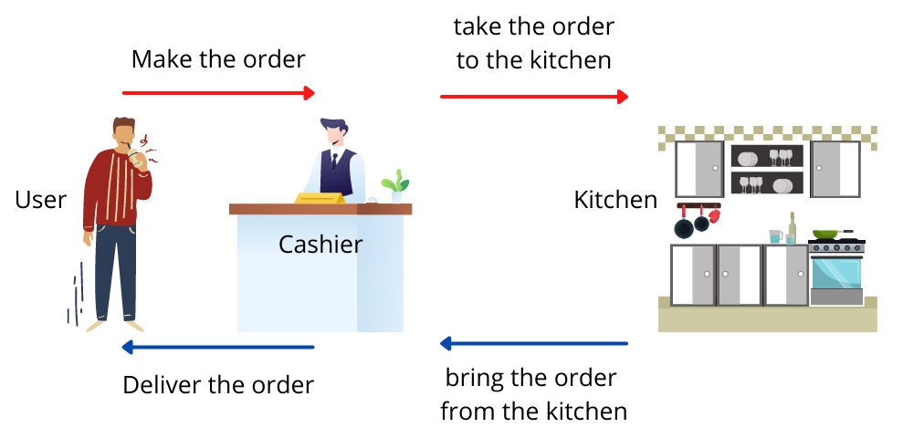

# Introdução ao HTTP/HTTPS
<!-- TOC -->

- [Introdução ao HTTP/HTTPS](#introdução-ao-httphttps)
  - [Protocolo HTTP](#protocolo-http)
    - [Conceitos básicos de segurança](#conceitos-básicos-de-segurança)
      - [Criptografia por chave](#criptografia-por-chave)
    - [Protocolo SSL](#protocolo-ssl)
  - [API e Padrão REST](#api-e-padrão-rest)
    - [O que é API?](#o-que-é-api)
      - [Utilidade](#utilidade)
    - [Propriedades de uma API](#propriedades-de-uma-api)
      - [Acesso de dados](#acesso-de-dados)
      - [Esconder complexidade](#esconder-complexidade)
      - [Estender funcionalidades](#estender-funcionalidades)
      - [Segurança](#segurança)
    - [Padrão REST](#padrão-rest)
      - [HTTP:](#http)
      - [Regras:](#regras)
      - [Vantagem:](#vantagem)
      - [Por que utilizar?](#por-que-utilizar)
    - [API HTTP-Java](#api-http-java)
    - [Estudo de caso, parte 1](#estudo-de-caso-parte-1)
    - [Estudo de caso, parte 2](#estudo-de-caso-parte-2)
  - [Conclusão do curso](#conclusão-do-curso)
    - [Certifique seu conhecimento](#certifique-seu-conhecimento)
  - [Referências](#referências)

<!-- /TOC -->

## Protocolo HTTP

### Conceitos básicos de segurança

#### Criptografia por chave
- **Assimétrica**
  - Chave privada
    - Assinatura - Criptografia
  - Chave Pública
    - Verificação de autenticidade
- **Simétrica**
  - Chave única privada (Cifra de césar)
    > Conhecimento prévio \
    > Método por substituição
  - **Tipos**
    - Cifra de fluxo
      - Sequência de bits pseudo-aleatório
      - Mapeamento 1 para 1
    - Cifra de bloco
      - **PGP:** troca de email
      - **Ipsec:** tunelamento
      - **SSL:** permutação entre blocos com k número de bits.
      > Ex. quando k= 64 bits | $2^0,2^1,2^2,2^3,2^4,2^5,2^6$
        - Mapeamento por funções/protocolos
          - DES
          - AES
          - 3DES
    - Certificação das chaves
      - Entidades certificadores
        - Verificação de identidade
        - Emissão de certificados
          - Chave única
      - Padrões de autoridades certificadores
        - IETF - recomendação ITUX.509
        > Especificação de um serviço de autenticação e sintaxe de certificados.
        - RFC 1422
        > Gerencia,emtp de chaves baseado em CA em emails seguros
      
### Protocolo SSL
> **S**ecure **S**ocket **L**ayer

- **Segurança para conexões TCP**
  - Confidencialidade
  - Integridade
  - Autenticidade end-point

- **Qual é a importancia do SSL?**
  - Prevenir ataques
    - Cenário 1: Listening
    - Cenário 2: Ataque ativo
- **Operação - fases**
  > Handshake\
  > Key Derivation\
  > Data transfer
- **Estabelecer conexão TCP**
    - TCP starts > TCP response > TCP confirmation
  - Verificação de autenticidade
    - SSL Hello
    - Certification
- **Envio da Master Secret Key**
  - EMS
  - EMS = `KB`+MS
- **Transferência efetiva de dados**
    > Record+Mac
  - Segurança na comunicação - HTTP Over TCP
  - Verificação da autenticidade por cetificados digitais `porta 443`

- **LGPD - Lei Geral de Proteção de Dados**
  > Não pode haver identificação da pessoa.
  - O que a lei protege?
    - Dados de ifentificação dos usuários
    - Dados sensíveis
    - Religião, etnia...
  - Define o tratamento de dados
    > Diversos tipos de operações
    - Livre conssentimento
    - Direitos do titular das informações
    - Sansões aos que descumprem as regras

## API e Padrão REST

### O que é API?
> Application Programming Interface

- É uma coleção de métodos disponibilizados por um serviço para interação indireta. Seja essa interação realizada por, Sistema **<->** Sistema, ou Sistema **<->** Usuário

#### Utilidade
- Rotinas e padrões
- Acesso:
  - sistemas ou plataforma web
- Utilização dos serviços da empresa
  - >Ex. Sistema de maps, previsão do tempo, cotação de moedas, etc.

- Recursos disponíveis em uma API padrão Java
- Programas de suporte
- Possui partes funcionais chamadas pacotes (o que nós denominamos bibliotecas)
  - java.io
  - java.applet
  - java.security
  - java.math

### Propriedades de uma API

#### Acesso de dados
> Acesso aos dados do banco de dados do site ou servidor.

 A [API](#o-que-%C3%A9-api) recebe uma **[query](../database/glossário.md#Query)** do usuário/sistema e a envia para o site/servidor.
 Então o servidor executa a query e emite uma resposta para o requisitante. A mensagem impressa pode conter, ou não, as informações solicitadas.

#### Esconder complexidade
- Acesso à dados:
  - Arquivos, Banco de dados,...
- Eecutar operações complexas:
  - Rotinas e funções
- Transparente:
  - Comandos hardware
  - funções especificicas do sistema
- Intermédio de execução
  - Dev:
    - Foca na funcionalidade do app

#### Estender funcionalidades
- Comunicação entre software e hardware
  - Comunicação integrada
  
- Comunicação entre aplicativos
  - Exemplo: Site **<->** [API Google Maps](https://developers.google.com/maps/documentation?hl=pt-br)
  

#### Segurança
> Uso de protocolos de segurança para proteção da aplicação/servidor e do usuário final.

Há dados/funcionalidades que são necessários para o funcionamento da aplicação. Quem faz esse gerenciamento de segurança é uma API do SO, que questiona o usuário se ele permite, ou não, que aquela aplicação receba as permissões solicitadas. 

### Padrão REST

#### HTTP:
  - Comunicação entre API e Sistema

#### Regras:
  - Arquitetura REST
  > Foi apresentada por Roy Fielding - 2000, e significa REpresetational State Tranfer[^1].

#### Vantagem:
  - Independência da aplicação
  - Usabilidade
  - Mabeabilidade
  - **

Modelo
**

      - Cliente-server
        - 

Front x Back:

            
            > O lado do cliente se preocupa com interface, e o lgado do servidor com o armazenamento, por exemplo.
          - Princípio da separação
            - Portabilidade Interface do usuário
          - Menos complexcidade
            - Aumento da escalabilidade
          - Organização dos Devs
            - Simplifica os componentes dos servidores
          

          
      - 

Stateless

      
          - Request
            - Fornecer completo entendimento para o servidor
          - Visibilidade
          - Confiabilidade
          - Escalabilidade
          
          - Escolha - Tradeoff
            - Repetição de dados
            - Per-interaction overhead
            - Performance da rexe x propiedades do REST

        

      - 

Cache

      
          - Objetivo: aumentar eficiencia da rede
          - Label Requests: Cacheable or non-cacheable
          - Reduz latência e interação

        

      - 

Uniform Interface

      
          - Diferencial: Ênfase de uma interface uniforme entre componentes
          - Generalidade: Princípio de eng. de Software
          - Arquitetura de multiplas restrições
            - Identificação de recursos
            - Manipulação de recursos
              - Representações - ex: verbos HTTP
            - Auto-descrição
              - Processamento da informação
          - HATEOAS: Hypermedia As The Engine Of Application State[^2].
            > Ex: métodos HTTPS.

        

      - 

Layered System

      
          - Composição hierárquica de camadas
            - Encapsulamento
            - Proteção de dados
          - Latência e overhead de dados
            - Compensado pelo uso de cache

        

      - 

Code on Demand

      
          - Funcionalidade de clientes: applets ou scripts
          - Simplificação
            - Redução de fetures à serem pré-implementadas
            - Sistema extensível x diminuição de visibilidade

        

    

#### Por que utilizar?
  >Padrão comumente adotado;\
  >Conversa bem com o protocolo HTTP;\
  >Permite criação de APIs mais eficientes;\
  >Foco no desenvolvimento.

### API HTTP-Java

### Estudo de caso, parte 1

### Estudo de caso, parte 2

## Conclusão do curso

### Certifique seu conhecimento

## Referências
[^1]: https://www.ics.uci.edu/~fielding/pubs/dissertation/rest_arch_style.htm
[^2]: http://api/project.net/users/1

- Cursos:
  - [DIO](https://web.dio.me/)
    - [Introdução ao HTTP/HTTPS](https://web.dio.me/course/introducao-ao-http-https)
      - Prints = {01}
- Imagens:
  - [Medium](https://medium.com/)
    - Figuras = {01, 02}
  - [DevMedia](https://www.devmedia.com.br/)
    - Figuras = {03}
  - [Cequens](https://www.cequens.com/)
    - Figuras = {04, 05}

