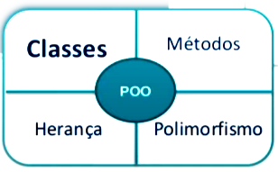
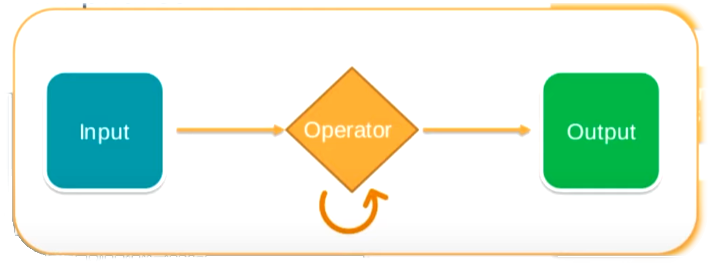
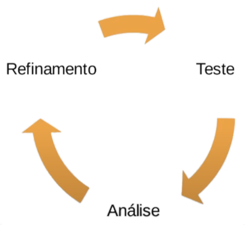
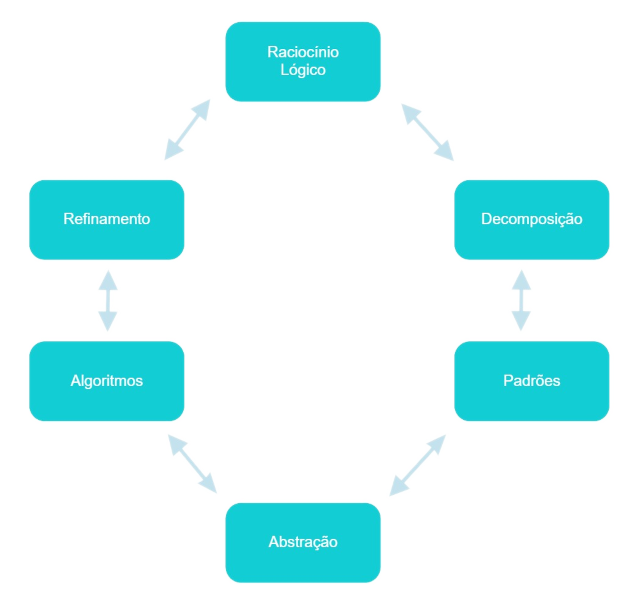
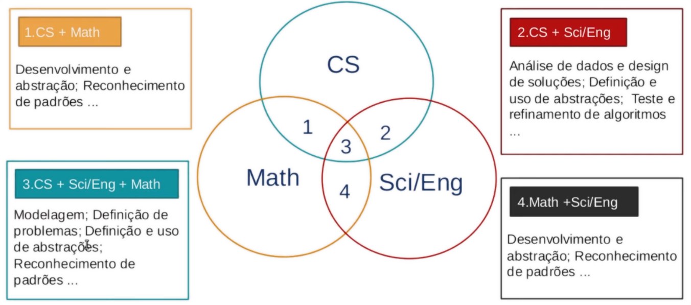
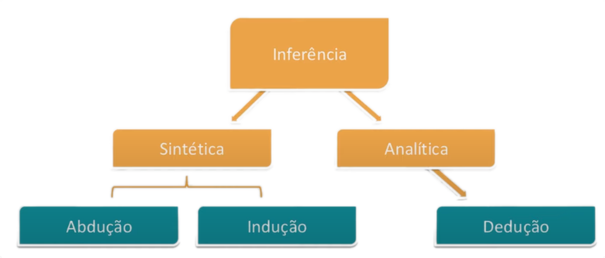

# Curso: Pensamento Computacional

Professora: Juliana Mascarenhas \
Linkedin: https://www.linkedin.com/in/juliana-mascarenhas-00349426/

## Aula 1: Visão Geral

O que é o Pensamento computacional?

> Refere-se ao processo de pensamento envolvido na expressão de soluções em passos computacionais ou algoritimos que podem ser implementados no computador. \
>(Aho, 2011; Lee, 2016)

É uma habilidade de fomulação e resolução de problemas, Sistemático e Eficiente, de modo que seres humanos e máquinas possam entender.

- Escrita
- Leitura
- Matemática

### Basea-se em 4 pilares
- Decomposição: dividir um problema em subproblemas(problemas menores);
- Reconhecimento de padrões:
  - Padrão geométrico
  - Padrão comportamental
  - Padrão de valorização por co-relação
- Abstração: 
  - Extrapolar o coneito do problema para uma forma generalista
  
- Design de algoritimos:
  - Automatizar: definir passo a passo a solução do problema.
  

### Processo Contínuo
  - Definir uma soluação
  - Testar a solução
  - Aperfeiçoamento da solução encontrada.

### Overview
1) Abstração: resolução de problemas
2) Automatização: Expressão de solução
3) Análise: Execução da solução e refinamento.

### Variação dos pilares

- Raciocínio lógico
- Refinamento

### Pilares

### Competências

- Pensamento sistemático
- Colaboração dentro da equipe
- Criatividade e design
- Facilitador

### Habilidades complementares

- **Raciocínio lógico:** pensamento estruturado.
  - Indução: Fenômeno observado, por meio do experimento;
  - Dedução: leis e teorias. Previsões, explicações;
  - Abdução: Conclusão por meio da premissa, por meio de investigação e diganósticos.

  

## Aula 2: Pilares do Pensamento Computacional

### Decomposição

### Reconhecimento de padrões

- Modelo base
- Estrutura invariante
- Repetição

Ex: Coletar informações (METADADOS) -> Compressão -> Salvar dados no servidor;

Ex2: Compressão de dados: transformação de dados de um mesmo grupo em vetores;

#### Seres vivos x padrões
- Porque deerminar padrões? É uma forma de generalizar, com objetivo de obter soluções para problemas diferentes.
- Classificação de objetos
  - Grau de similaridade
  - Grupos conhecidos X objeto desconhecido
  - Representação de atributos
  - aprendizado
  - Armazenar dados
  - Regras de decisão

(Extração de caracteristicas | Classificação de dados ) -> **Abordagem** -> DIFERENTES ( Métodos | Aplicações )

#### Aplicações
- Classificação de dados
- Reconhecimento de imagem
- Reconhecimento de fala
- Análise de cenas
- Classificação de documentos

Estes são exemplos de aplicações utilizados em:
- Machine Learning
- Redes Neurais
- Inteligência Artificial
### Abstração

#### Generalização x Abstração

> **Abstrair:** Analisar observando um ou os muitos aspectos que estão contidos num todo: abstrair os detalhes do tecido.[^1]

> **Abstração:** Ação de abstrair, de analisar isoladamente um aspecto, contido num todo, sem ter em consideração sua relação com a realidade.[^2]

> **Generalizar:** Fazer com que fique maior; aumentar a extensão de alguma coisa: generalizar uma teoria.[^3]

> **Generalização:** [*Lógica*] Operação intelectual que consiste em comparar as qualidades comuns a uma classe de indivíduos, desprezando as suas diferenças e reunindo essas qualidades comuns numa só ideia, que as fixa e define.[^4]

**Como classificar?**
- Caracteristicas
- Identificar pontos essenciais
- Generalizar x detalhar

Ao representar dados é necessário focar nos pontos essenciais de modo que deixe de lado os detalhes "dispensáveis".

- Conceitos baseados em abstrações (*Python, Java, C++*):
  - Merge sort
  - Clusteting
  - Busca binária
- Estrutura de dados
  - Arvore
  - Lista
  - Gráficos
- Comunicação
  - Broadcast
  - Síncrona
  - Assíncrona
  - Paralela
- Arquiteturas
  - Servidor
  - Ponto a Ponto
  - Estrela
  - Dock

**Exemplos:** 
Eu preciso limpar um terreno, por onde devo começar?
- Classificação?
- Distancias?
- Ordem da limpeza

### Algoritmos

## Aula 3: Estudos de Caso

## Certifique seu conhecimento

[^1]:https://www.dicio.com.br/abstrair/
[^2]:https://www.dicio.com.br/abstracao/
[^3]:https://www.dicio.com.br/generalizar/
[^4]:https://www.dicio.com.br/generalizacao/
[^5]:
[^6]:
[^7]:
